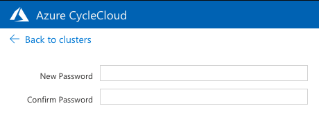
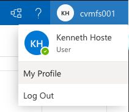
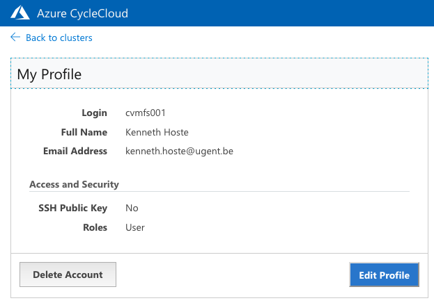
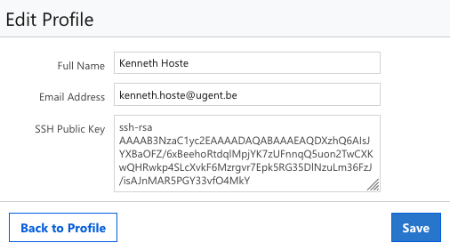
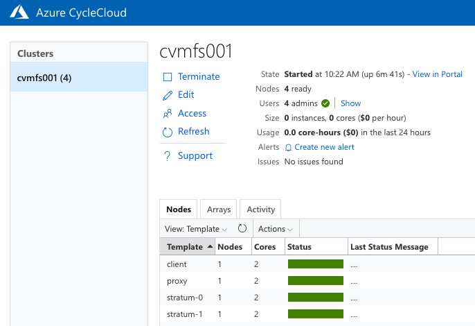
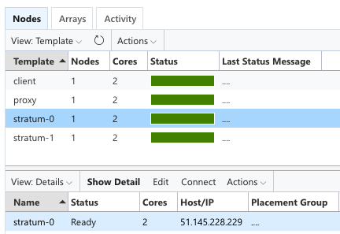
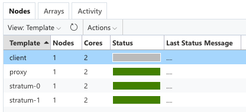
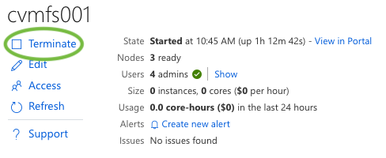

# 0. Azure cloud resources

<p align="center">

</p>

For **registered** attendees of the [CernVM-FS tutorial at the 6th EasyBuild User Meeting (Jan 25-29 2021)](https://easybuild.io/eum/#cvmfs-tutorial),
a small cluster of virtual machines is available in Microsoft Azure to use for the hands-on parts of the tutorial.

**These resources are sponsored by Microsoft.**

## Step 0: Log in to CycleCloud

To get started, you should log into the Azure CycleCloud web portal, where you can manage the virtual machine cluster
that was prepared for you.

Visit [https://cvmfstutorial.westeurope.cloudapp.azure.com](https://cvmfstutorial.westeurope.cloudapp.azure.com),
and log in **with the user name (`cvmfs0XY`) and the password that you received via email** (don't try using
`cvmfs001` as shown in the screenshot below, that will not work).

<p align="center">

</p>

You will need to create and confirm a new password in order to login in.

**Make sure you use a password you can remember!**.

<p align="center">

</p>

If you need a password reset, either contact [eum@lists.ugent.be](mailto:eum@lists.ugent.be),
or ask in the [`#eum21-cvmfs-tutorial`](https://easybuild.slack.com/archives/C01KFR7MPE1) channel in the EasyBuild Slack.

## Step 1: Add SSH public key

Before you do anything with the nodes in the cluster, make sure you add your SSH public key into your CycleCloud
account.

**Note: this *must* be an RSA SSH public key (`ed25519` will not work)!**

Use `My Profile` which you can access by clicking your name in the top right corner:

<p align="center">

</p>

Then click `Edit Profile`:

<p align="center">

</p>

Add your SSH public key (**must be RSA!**), and click `Save`.

<p align="center">

</p>

Then use the `Back to cluster` link at the top left corner to return to the previous screen.

## Step 2: Start cluster

Once you have added your SSH public key, you can start the cluster using the `Start` "play" button:

<p align="center">

</p>

Shortly after, you should see that all nodes were started (green status bar):

<p align="center">

</p>

## Step 3: SSH into a node

Once a node is started, you can SSH into it using your `cvmfs0XY` user name and the public IP address of the node.

To determine the IP address of a node, select it in the `Nodes` overview: the IP address will be shown in
the `Host/IP` column in the detailed view at the bottom:

<p align="center">

</p>

To log into the node, use the `ssh` command from a Linux or macOS system:

```shell
# change accordingly for your user name and IP address!
$ ssh cvmfs001@51.145.228.229
The authenticity of host '51.145.228.229 (51.145.228.229)' can't be established.
ECDSA key fingerprint is SHA256:Lv19NNnDJlMEcJskqS9tU7SlyLibD3u1vKSc7HJqlAM.
Are you sure you want to continue connecting (yes/no/[fingerprint])? yes
Warning: Permanently added '51.145.228.229' (ECDSA) to the list of known hosts.
[cvmfs001@ip-0A000009 ~]$
```

(or use `PuTTy` on Windows).

You will need to confirm the host key fingerprint the first time you log in (enter `yes` as shown above).

Once you're logged in, you are ready to get started with the hands-on parts of the tutorial!

## Suspend unused nodes!

To limit the resources you consume, we ask that you **suspend** the nodes that you are not actively using.

See below for detailed instructions on suspending a single nodes, or all nodes at once.

Suspended nodes can later be restarted, and no data or configuration settings should be lost.
All nodes will also still be using the same IP address.

**Keep in mind to suspend all nodes each day after finishing the exercise for that part of the tutorial!**

## Other actions

### Suspending a single node

To suspend a single node, select it and use `Actions` -> `Shut down`:

<p align="center">

</p>

**Select the `Deallocate ...` option**.

If you don't use the `Deallocate` option all data will be lost on that data, and you'll need to start over
again!

<p align="center">

</p>

Click `Shut down` to suspend the node.

### Starting a single node

To start a single node after suspending it, select it and use `Actions` -> `Start`.

<p align="center">

</p>

Shortly after, the node should be fully operational again (with the same IP).

### Suspending all nodes

To suspend *all* nodes at once, you can select them all before using `Actions` -> `Shut down`:

<p align="center">

</p>

**Make sure to use the `Deallocate ...` option**, or *all* your data and configuration will be lost!

<p align="center">

</p>

Click `Shut down` to suspend all nodes.

### Restarting all nodes

To restart all suspended nodes, select them all and use `Actions` -> `Start`.

<p align="center">

</p>

Shortly after, all nodes should be fully operational again (with the same IPs).

### Resetting a single node

If you have made some mistakes, and would like to *reset* a node to start from a blank slate,
you can do so as follows:

* Select the node and use `Actions` -> `Shut Down`:
  <p align="center">
  
  </p>

* Use the `Terminate ...` option (the default). **Do keep in mind that this will erase all data and configuration for that node!**
  <p align="center">
  
  </p>

* Click `Shut down`, and wait until the node is fully off (gray status bar):
  <p align="center">
  
  </p>

* Finally, start the node again to complete the reset cycle:
  <p align="center">
  
  </p>

### Resetting all nodes (entire cluster)

If you want to restart from scratch on *all* nodes, you can do so to.

**Keep in mind that all data and configuration on *all* nodes will be lost when doing this.**

Terminate the entire cluster using the `Terminate` button just below the cluster name (same as your user name):

<p align="center">

</p>

Once the cluster is fully shut down (all node status bars are gray), you can start it again:

<p align="center">

</p>
