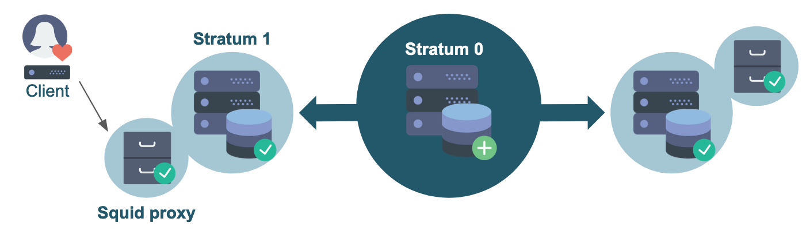

# 3. Stratum 1 and proxies

In the previous section we have set up a Stratum 0 server and a client that directly connects to the Stratum 0.
Although this worked fine this is *not recommended*, since this setup is neither scalable, nor very reliable, nor secure:
it is a single point of failure, too open in terms of connectivity, and it will have to serve all clients on its own.

Therefore, we will show how all these points can be addressed by adding a **Stratum 1 server** and a **caching proxy server**.

Quick reminder: a Stratum 1 is a *replica server* that keeps *mirrors* of the repositories served by a Stratum 0.
It is a web server that periodically synchronizes the contents of the repositories.

In contrast to the central Stratum 0 server you can have *multiple* Stratum 1 servers,
and it is recommended to have them geographically distributed, so that clients always have a nearby Stratum 1.

How many Stratum 1 servers you need mostly depends on the number of clients and how they are
distributed geographically, but often a few is already sufficient.

Scalability and performance can be improved with proxies, which we will discuss later in this section.

<p align="center">

</p>

## 3.1 Setting up the Stratum 1 server


### 3.1.1 Requirements

A Stratum 1 server has [similar requirements as a Stratum 0 in terms of resources](02_stratum0_client.md#211-requirements).

In addition to port 80 (for the Apache web server), port 8000 also has to be accessible for a Stratum 1
(for the Squid proxy frontend).

Furthermore, you need a (free) license key for [Maxmind's Geo API](https://dev.maxmind.com/geoip/geoip2/geolite2/),
which you can obtain by [signing up for an account](https://www.maxmind.com/en/geolite2/signup/). This is used
by CernVM-FS to allow clients to determine which Stratum 1 server is geographically located closest.

### 3.1.2 Installation

For the Stratum 1 you need to install the following packages:

```bash
# sudo yum install -y epel-release  # only needed on CentOS 7
sudo yum install -y https://ecsft.cern.ch/dist/cvmfs/cvmfs-release/cvmfs-release-latest.noarch.rpm
sudo yum install -y cvmfs-server squid
# sudo yum install -y mod_wsgi # on CentOS 7
sudo yum install -y python3-mod_wsgi  # on CenOS 8
```

This is:

- `cvmfs-server`: the CermVM-FS server package (just like for Stratum 0);
- `mod_wsgi`: an Apache module that provides a WSGI compliant
  interface for hosting Python based web applications within Apache,
  which is required by CernVM-FS to query the Geo API (more on that later);
- `squid`: the Squid proxy package;

### 3.1.3 Configuring Apache and Squid proxy

On the Stratum 1, we will be running Apache with a Squid frontend (reverse proxy).

The Apache web server will be listening internally on port 8080,
while the Squid proxy needs to listen (externally) on port 80 and 8000, which are the default Stratum 1 ports.

#### Apache configuration

First, we modify the Apache webserver configuration, by editing `/etc/httpd/conf/httpd.conf` and change the default:
```
Listen 80
```
to:
```
Listen 127.0.0.1:8080
```

#### Squid configuration

Next, we replace the default contents of `/etc/squid/squid.conf` with the following:
```
http_port 80 accel
http_port 8000 accel
http_access allow all
cache_peer 127.0.0.1 parent 8080 0 no-query originserver

acl CVMFSAPI urlpath_regex ^/cvmfs/[^/]*/api/
cache deny !CVMFSAPI

cache_mem 128 MB
```

To clarify:

- [`http_port`](http://www.squid-cache.org/Doc/config/http_port) specifies on which ports Squid will listen for HTTP requests;
- [`http_access`](http://www.squid-cache.org/Doc/config/http_access) specifies access restrictions for HTTP traffic (none, in this case);
- [`cache_peer`](http://www.squid-cache.org/Doc/config/cache_peer) specifies that the Apache web server is listening on port 8080;
- [`acl`](http://www.squid-cache.org/Doc/config/acl) specifies the access list for CernVM-FS: only paths under `/cvmfs/*/api/` are relevant;
- [`cache`](http://www.squid-cache.org/Doc/config/cache) specifies which paths should be cached by the Squid proxy (only
  paths that match the regular expression on the line above);
- [`cache_mem`](http://www.squid-cache_mem.org/Doc/config/cache_mem) specifies the amount of memory that Squid is allowed to use;

For more information, see the Squid documentation: [http://www.squid-cache.org/Doc/config/](http://www.squid-cache.org/Doc/config/).

#### Start & enable services

Finally, we start and enable both the Apache and Squid services:

```bash
sudo systemctl start httpd
sudo systemctl start squid
sudo systemctl enable httpd
sudo systemctl enable squid
```


### 3.1.4 DNS cache

As a Stratum 1 server does a lot of DNS lookups, it is recommended to have a local DNS caching server on that same
system.

We will not discuss this topic any further here, but you can use `dnsmasq`, `bind`, or `systemd-resolved`.
See for instance [this tutorial](https://geekflare.com/linux-server-local-dns-caching/) for setting up `systemd-resolved`.

### 3.1.5 Creating the Stratum 1 replica

With all the required components in place, we can now really set up our Stratum 1 replica server.

#### Create and add Geo API key (optional)

We first add our Geo API key to the CernVM-FS server settings, by creating it
and then running these commands:

```bash
echo 'CVMFS_GEO_LICENSE_KEY=YOUR_KEY' | sudo tee -a /etc/cvmfs/server.local
sudo chmod 600 /etc/cvmfs/server.local
```

*Replace `YOUR_KEY` with your Geo API license key; see [https://www.maxmind.com/en/accounts/YOUR_ACCOUNT_ID/license-key](https://www.maxmind.com/en/accounts/YOUR_ACCOUNT_ID/license-key)!*

Note that this is not strictly required for the sake of this tutorial, but it's highly recommended.

#### Add repository master public key

We also need to have the public master key of each repository we want to mirror to be available on our Stratum 1.

This can be done by copying the `.pub` file(s) from `/etc/cvmfs/keys` on the Stratum 0 server to
`/etc/cvmfs/keys/organization.tld/` (note the extra level!) on the Stratum 1 server, just like we did on the client.

#### Create replica

Now we make the replica by giving the URL to the repository on the Stratum 0 server
(which is always like `http://host:port/cvmfs/repository`, with the `:port` part optional)
and the path to the corresponding public master key:

```bash
sudo cvmfs_server add-replica -o $USER http://<STRATUM0_IP>/cvmfs/repo.organization.tld /etc/cvmfs/keys/organization.tld/
```

***Replace the ``<STRATUM0_IP>`` part with the IP address of your Stratum 0 server,
and adjust for the name and domain of your CernVM-FS repository!***

Executing the `add-replica` command should produce output reporting on the steps being performed,
and only take a couple of moments to complete.

*If no output is produced and the command seems to be hanging, make sure that port 80 on your Stratum 0 server
is accessible via the IP address you are using!*

#### Bypassing the Geo API license key

If you prefer not to create a MaxMind account and Geo API license key for the sake of this tutorial,
you can bypass the "`CVMFS_GEO_LICENSE_KEY not set`" error message
produced by `cvmfs_server add-replica` by defining the `$CVMFS_GEO_DB_FILE` environment variable
to `NONE` before running the command:

```bash
# only do this if you do not want to provide a Geo API key (not recommended!)
export CVMFS_GEO_DB_FILE=NONE
```

#### Remove the replica

If you ever want to remove the repository replica again, you can use the `rmfs` subcommand in the same way as on Stratum 0:

```bash
sudo cvmfs_server rmfs repo.organization.tld
```

### 3.1.6 Manually synchronize the Stratum 1

Now that the Stratum 1 has been registered, we should try to do a first synchronization.
You can do this by running the following command:

```bash
sudo cvmfs_server snapshot repo.organization.tld
```
As there is not much in the repository yet, this should complete within a few seconds.

The output should end with something like:

```
Serving revision 2
Fetched 2 new chunks out of 3 processed chunks
```

### 3.1.7 Adding cron jobs

Whenever you make changes to the repository, the changes have to be synchronized to all Stratum 1 servers.
Furthermore, the GeoIP database has to be updated regularly.

Both tasks can be automated by setting up cron jobs that periodically run `cvmfs_server update-geodb` and `cvmfs_server snapshot -a`, where `-a` does the synchronization for all active repositories. This option will give an error if no log rotation has been configured for CernVM-FS, so we first have to create a file `/etc/logrotate.d/cvmfs` with the following contents:

```
/var/log/cvmfs/*.log {
    weekly
    missingok
    notifempty
}
```

Now we can make a cronjob `/etc/cron.d/cvmfs_stratum1_snapshot` for the snapshots:

```
*/5 * * * * root output=$(/usr/bin/cvmfs_server snapshot -a -i 2>&1) || echo "$output"
```

And another cronjob `/etc/cron.d/cvmfs_geoip_db_update` for updating the Geo database:
```
4 2 2 * * root /usr/bin/cvmfs_server update-geodb
```

## 3.2 Setting up a proxy

If you have a lot of local machines, e.g. an HPC cluster, that need to access your repositories, you also want another cache layer close to these machines.

This can be done by adding one or more Squid proxies between your local machine(s) and the Stratum 1 server(s).
It is recommended to have at least two proxies, for reliability and load-balancing reasons.

### 3.2.1 Requirements

Just as with the other components, the Squid proxy server does not need a lot of resources.
Just a few cores and few gigabytes of memory should be enough. The more disk space you allocate
for this machine, the larger the cache can be, and the better the performance will be.

Note that this system will only store a part of the (deduplicated and compressed) repository,
so it does not need as much storage space as Stratum 0 or Stratum 1 server.

### 3.2.2 Installation

On the proxy server only Squid needs to be installed:
```
sudo yum install -y squid
```

### 3.2.3 Configuration

The configuration of a standalone Squid proxy is slightly different from the one that we used for our Stratum 1.

You can use the following *template* to set up your own Squid configuration for your proxy server (in `/etc/squid/squid.conf`):

```
# List of local IP addresses (separate IPs and/or CIDR notation) allowed to access your local proxy
acl local_nodes src YOUR_CLIENT_IPS

# Destination domains that are allowed
#acl stratum_ones dstdomain .YOURDOMAIN.ORG
#acl stratum_ones dstdom_regex YOUR_REGEX

# Squid port
http_port 3128

# Deny access to anything which is not part of our stratum_ones ACL.
http_access deny !stratum_ones

# Only allow access from our local machines
http_access allow local_nodes
http_access allow localhost

# Finally, deny all other access to this proxy
http_access deny all

minimum_expiry_time 0
maximum_object_size 1024 MB

cache_mem 128 MB
maximum_object_size_in_memory 128 KB
# 5 GB disk cache
cache_dir ufs /var/spool/squid 5000 16 256
```

In this template, there are a two things you must change in the Access Control List (ACL) settings:

- The line starting with `acl local_nodes` specifies which clients are allowed to use this proxy.
  You can use [CIDR notation](https://en.wikipedia.org/wiki/Classless_Inter-Domain_Routing#CIDR_notation).
  For the sake of this tutorial, you can just replace `YOUR_CLIENT_IPS` with the IP of your client system.
  For example:
  ```
  acl local_nodes src 1.2.3.4
  ```

- You will need to add a line starting with `acl stratum_ones` to specify an ACL for
  the allowed destination domains.
  For the sake of this tutorial, we can just "hardcode" this to our Stratum 1 server via `dst` (destination):
  ```
  acl stratum_ones dst <STRATUM1_IP>
  ```
  (where you need to change `<STRATUM1_IP>` with the IP address of your Stratum 1 server)

The `stratum_ones` ACL you defined is used to specify that the Squid should only cache the Stratum 1 server,
via the first `http_access deny` line.

More information about Squid ACLs can be found in the [Squid documentation](http://www.squid-cache.org/Doc/config/acl/).

Finally, there are some settings regarding the size of your cache. Make sure that you have enough disk space for the value that you provide.

### 3.2.4 Verifying Squid configuration

To verify the correctness of your Squid configuration, you can run:

```bash
sudo squid -k parse
```

When things look OK (no errors or warnings are printed, exit code zero), you can start and enable Squid.

### 3.2.5 Starting and enabling Squid

To start and enable Squid, run:

```
sudo systemctl start squid
sudo systemctl enable squid
```

## 3.3 Re-configuring the client

Now that we have a Stratum 0 server, a Stratum 1 server, and a Squid proxy,
we have the (minimal) infrastructure in place for a production-ready CernVM-FS setup.

So we can now configure our client properly, and start using the repository.


In the previous section we connected our client directly to the Stratum 0. We are going to reuse that configuration, and only need to change two things.

### 3.3.1 Connect to the Stratum 1

We used the URL of the Stratum 0 in the file `/etc/cvmfs/config.d/repo.organization.tld.conf`. We should now change this URL, and point to the Stratum 1 instead:
```
CVMFS_SERVER_URL="http://<STRATUM1_IP>/cvmfs/@fqrn@"
```

***Replace the ``<STRATUM1_IP>`` part with the IP address of your Stratum 1 server!***

When you have more Stratum 1 servers inside the organization, you can make it a semicolon-separated list of servers. The Geo API will make sure that your client always connects to the geographically closest Stratum 1 server.

### 3.3.2 Use the Squid proxy

In order to use the local cache layer of our proxy, we have to instruct the client to send all requests through the proxy.

This needs one small change in `/etc/cvmfs/default.local`, where you will have to replace `DIRECT`
with IP address of your Squid proxy service, plus the (default) port 3128 at which Squid is running: 
```
CVMFS_HTTP_PROXY="http://<PROXY_IP>:3128"
```

***Replace the ``<PROXY_IP>`` part with the IP address of your Squid proxy server!***

After changing the local configuration file, make sure to reload the CernVM-FS client configuration:

```bash
sudo cvmfs_config reload repo.organization.tld
```

More proxies can be added to that list by separating them with a pipe symbol.

For more (complex) examples, see the [CernVM-FS documentation](https://cvmfs.readthedocs.io/en/stable/cpt-configure.html#proxy-list-examples).


## Exercise

1) Set up a Stratum 1 server. Make sure that it includes:
- a proper Geo API license key;
- cron jobs for automatically synchronizing the database and updating the Geo database;
- properly configured Apache and Squid services;

2) Set up a separate Squid proxy. Though it is recommended to at least have two in production, one is enough for now.

3) Reconfigure the client that you set up in the previous section and make sure that it uses your Stratum 1 and Squid proxy.
- #TODO: reuse or set up a new client?? Add firewall rules to the Stratum 0?
