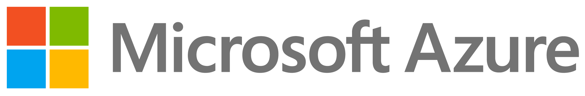

# Welcome to the CernVM-FS tutorial!

 

## Scope

This is an introductory tutorial to the [CernVM File System](https://cernvm.cern.ch/fs/) (CernVM-FS).

In this tutorial you will learn what CernVM-FS is and how to use it,
both from an administrator and end user point of view,
through guided examples and hands-on exercises.

We focus on the core concepts and basic usage of CernVM-FS, and provide pointers to more information
regarding more advanced aspects.

## Intended audience

This tutorial is intended for people who are new to CernVM-FS: no specific prior knowledge
or experience with it is required.

We expect it to be most valuable to people who are interested in either setting up and managing
a CernVM-FS repository themselves, or using one or more existing CernVM-FS repositories.

## Prerequisites

Being familiar with a Linux shell environment and having a basic notion of Linux filesystems
and system administration is recommended but not strictly required; we hope that the guided
examples are sufficient to follow along comfortably.

You should have access to a couple of Linux instances on which you have administrative rights (``sudo`` access).
The required resources are minimal: 1 or 2 cores, a couple of GBs of RAM,
and about 10GB of disk space per instance is more than sufficient.

We recommend using Linux virtual machines that were created specifically for this tutorial,
on which only a base Linux distribution was installed as operating system, and which
you are comfortable to discard afterwards.

This tutorial was prepared on CentOS 7 (`x86_64`), but it should be relatively straightforward
to translate the instructions to other Linux distributions like Ubuntu,
or another CPU architecture like Arm 64-bit (`aarch64`).

## Practical information

This tutorial is being organised during the **[6th EasyBuild User Meeting](https://easybuild.io/eum/) (Jan 25-29 2021)**.

More information about the CernVM-FS tutorial sessions is available at [https://easybuild.io/eum/#cvmfs-tutorial](https://easybuild.io/eum/#cvmfs-tutorial).

**[Registration](https://easybuild.io/eum/#registration) for this tutorial is required in order to get access to the provided cloud resources!**

 

Dedicated cloud resources in **[Microsoft Azure](https://azure.microsoft.com)** (sponsored by Microsoft) will be available *only
to registered tutorial attendees* for working on the hands-on exercises during the the week of Jan 25-29 2021.

Nothing in this tutorial, other than the [section of using the provided
Azure cloud resources](00_azure_cloud_resources.md), is specific to Azure.
You can use your own resources if you prefer doing so.

## Tutorial contents

- [0. Azure cloud resources](00_azure_cloud_resources.md)
- [1. Introduction to CernVM-FS](01_introduction.md)
- [2. Stratum 0 and client](02_stratum0_client.md) ``(*)``
- [3. Stratum 1 and proxies](03_stratum1_proxies.md) ``(*)``
- [4. Publishing](04_publishing.md) ``(*)``
- [5. Advanced topics](05_advanced.md)

*(sections indicated with* ``(*)`` *involve hands-on exercises)*

## Slides

The (minimal) slides used to guide the tutorial are available [here](eum21-cvmfs-tutorial-slides.pdf).

## Contributors

* Jakob Blomer (CERN, Switzerland)
* Bob Dröge (University of Groningen, The Netherlands)
* Kenneth Hoste (HPC-UGent, Belgium)
* Ryan Taylor (ComputeCanada)

## Additional resources

* CernVM-FS website: [https://cernvm.cern.ch/fs](https://cernvm.cern.ch/fs)
* CernVM-FS documentation: [https://cvmfs.readthedocs.io](https://cvmfs.readthedocs.io)
* CernVM-FS @ GitHub: [https://github.com/cvmfs](https://github.com/cvmfs)
* CernVM-FS tutorial @ GitHub: [https://github.com/cvmfs-contrib/cvmfs-tutorial-2021](https://github.com/cvmfs-contrib/cvmfs-tutorial-2021)
